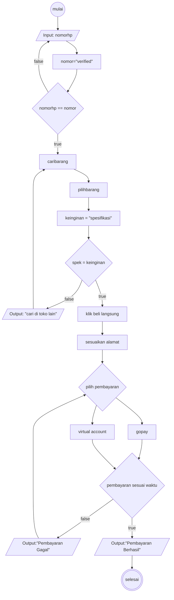

# Algoritma Chekout Tokopedia
## Deskriptif
1. Mulai
2. Login akun Tokopedia, masukan no hp yang terdaftar
3. cari barang yang akan dibeli
4. pilih barang yang akan dibeli
5. cek ukuran atau spesifikasi dari barang yang akan dibeli
6. jika tidak ada ukuran atau spesifikasi yang diinginkan, cari di toko lain
7. jika ukuran atau spesifikasi sudah sesuai, klik tombol beli langsung
8. sesuaikan alamat pengiriman
9. kemudian pilih metode pembayaran, melalui virtual account atau gopay
10. lakukan pembayaran sesuai dengan waktu yang ditentukan 
11. jika pembayaran melewati batas waktu yang ditentukan maka pembayaran gagal
12. jika pembayaran dilakukan tepat waktu, pembayaran berhasil
13. selesai

## Flowchart
