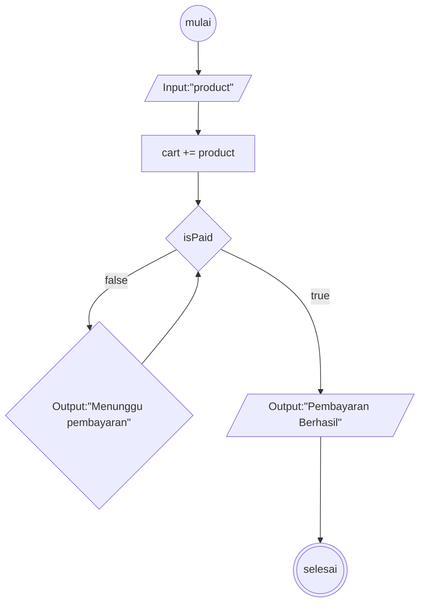

# Algoritma Checkout Tokopedia

## Deskriptif
1. mulai
2. memilih product yang akan dicheckout
3. memasukan product ke dalama keranjang
4. lakukan pembayaran barang yang akan dicheckout
5. jika pembayaran berhasil, menampilkan output pembayaran berhasil
6. jika pembayaran gagal maka kembali ke pembayaran
7. selesai

## Flowchart
