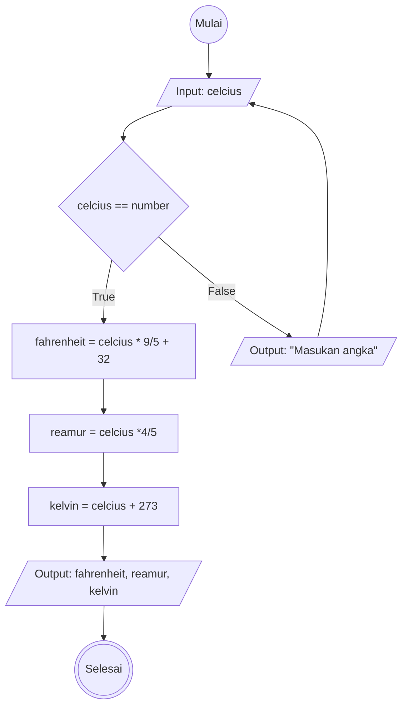

# Algoritma Program Konversi Suhu

## Deskriptif
1. Mulai
2. Masukkan nilai celcius
3. pengecekan nilai celcius yang dimasukkan, nilai harus berupa number
4. jika nilai yang dimasukkan bukan number, tampilkan "input harus berupa number"
5. jika nilai yang dimasukkan number, maka
6. Mengkonversi nilai celcius ke fahrenheit dengan cara nilai celcius dikalikan dengan 9/5 kemudian ditambah dengan 32
7. Mengkonversi nilai celcius ke reamur dengan cara nilai celcius dikalikan dengan 4/5
8. Mengkonversi nilai celcius ke kelvin dengan cara nilai celcius ditambahkan dengan 273
9. tampilkan nilai hasil konversi dari celcius ke fahrenheit, reamur, dan kelvin
10. Selesai

## Flowchart
