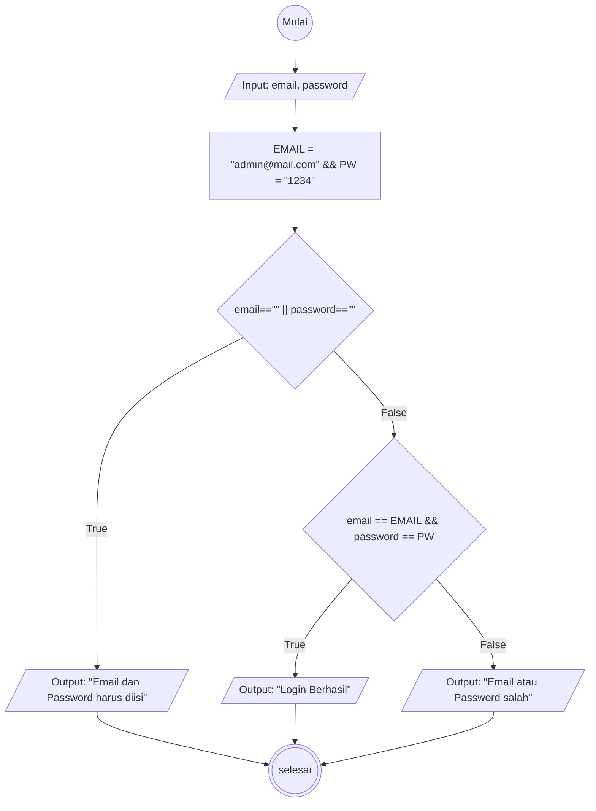

```mermaid
flowchart TD
    mulai@{ shape: circle, label: "Mulai"}
    input@{ shape: lean-r, label: "Input: email, password"}
    data@{ label: "EMAIL = #quot;admin@mail.com#quot; && PW = #quot;1234#quot;"}
    if1@{ shape: diamond, label: "email==#quot;#quot; || password==#quot;#quot;"}
    flse1@{ shape: lean-r, label: "Output: #quot;Email dan Password harus diisi#quot;"}
    true1@{ shape: diamond, label: "email == EMAIL && password == PW"}
    true2@{ shape: lean-r, label: "Output: #quot;Login Berhasil#quot;"}
    flse2@{ shape: lean-r, label: "Output: #quot;Email atau Password salah#quot;"}
    selesai@{ shape: dbl-circ}
    
    mulai-->input-->data-->
    if1--True-->flse1-->selesai
    if1--False-->true1--True-->true2-->selesai
    true1--False-->flse2-->selesai
    
```