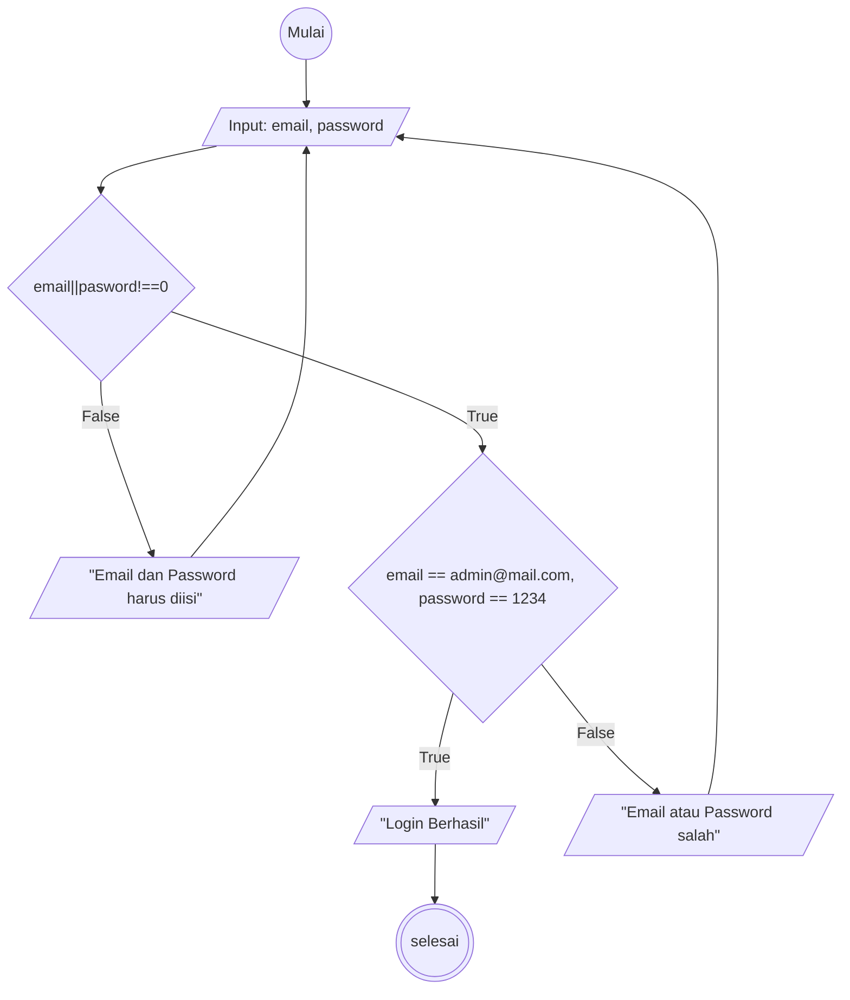

```mermaid
flowchart TD
    mulai@{ shape: circle, label: "Mulai"}
    input@{ shape: lean-r, label: "Input: email, password"}
    if1@{ shape: diamond, label: "email||pasword!==0"}
    flse1@{ shape: lean-r, label: "#quot;Email dan Password harus diisi#quot;"}
    true1@{ shape: diamond, label: "email == admin@mail.com, password == 1234"}
    true2@{ shape: lean-r, label: "#quot;Login Berhasil#quot;"}
    flse2@{ shape: lean-r, label: "#quot;Email atau Password salah#quot;"}
    selesai@{ shape: dbl-circ}
    
    mulai-->input-->if1
    if1--False-->flse1-->input
    if1--True-->true1--True-->true2-->selesai
    true1--False-->flse2-->input
    
```