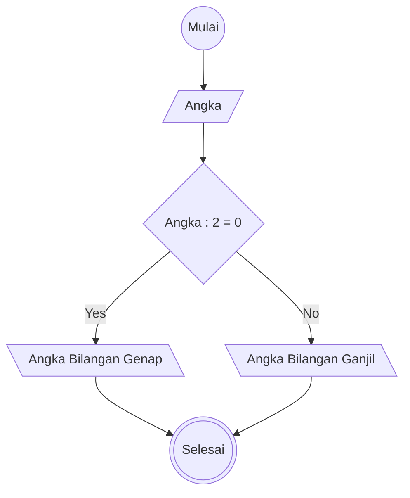

```mermaid
flowchart TD
    A@{ shape: circle, label: "Mulai" }
    B@{ shape: lean-r, label: "Angka"}
    C@{ shape: diamond, label: "Angka : 2 = 0"}
    F@{ shape: lean-l, label: "Angka Bilangan Genap"}
    G@{ shape: lean-l, label: "Angka Bilangan Ganjil"}
    H@{ shape: dbl-circ, label: "Selesai"}

A --> B --> C -- Yes --> F
C -- No --> G
F & G --> H
```