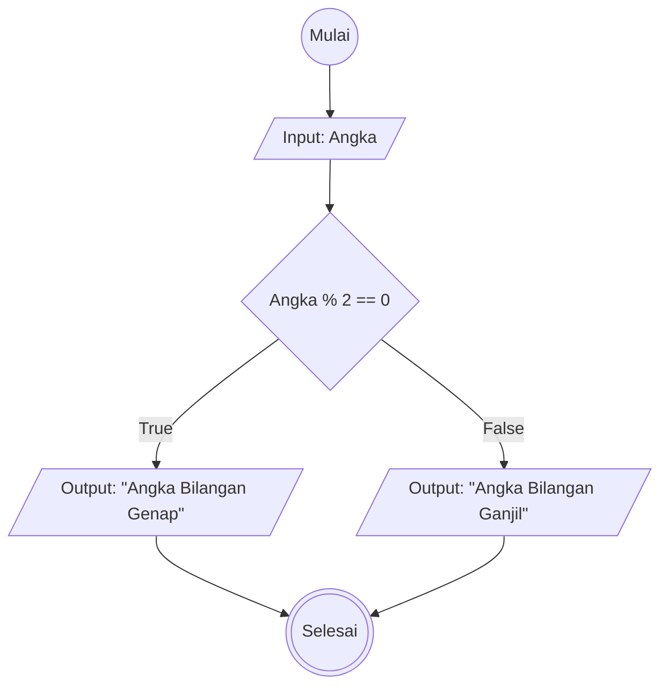

```mermaid
flowchart TD
    A@{ shape: circle, label: "Mulai" }
    B@{ shape: lean-r, label: "Input: Angka"}
    C@{ shape: diamond, label: "Angka % 2 == 0"}
    F@{ shape: lean-r, label: "Output: #quot;Angka Bilangan Genap#quot;"}
    G@{ shape: lean-r, label: "Output: #quot;Angka Bilangan Ganjil#quot;"}
    H@{ shape: dbl-circ, label: "Selesai"}

A --> B --> C -- True --> F
C -- False --> G
F & G --> H
```