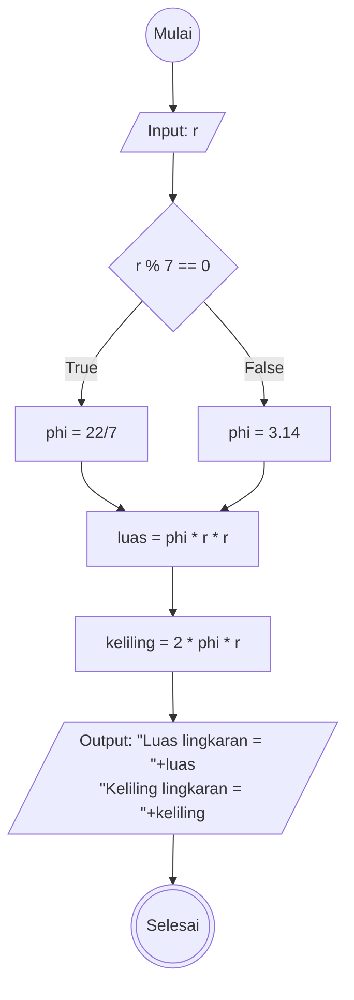

```mermaid
flowchart TD
    A@{ shape: circle, label: "Mulai"}
    B@{ shape: lean-r, label: "Input: r"}
    C@{ shape: diamond, label: "r % 7 == 0"}
    D@{ label: "phi = 3.14"}
    E@{ label: "phi = 22/7"}
    F@{ label: "luas = phi * r * r"}
    G@{ label: "keliling = 2 * phi * r"}
    H@{ shape: lean-r, label: "Output: #quot;Luas lingkaran = #quot;+luas
    #quot;Keliling lingkaran = #quot;+keliling"}
   
    
    L@{ shape: dbl-circ, label: "Selesai"}

A-->B-->C
C--True-->E-->F
C--False-->D-->F-->G-->H-->L

```